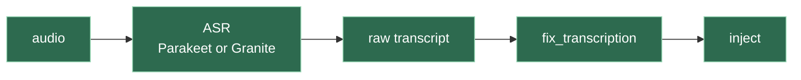
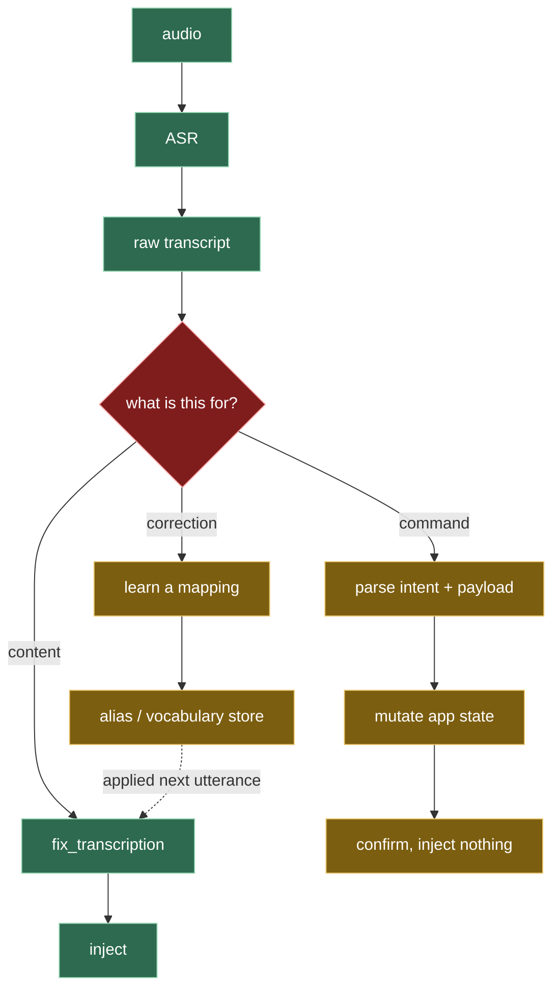
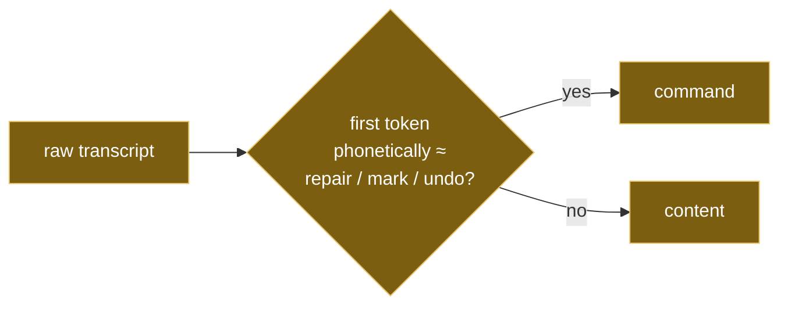
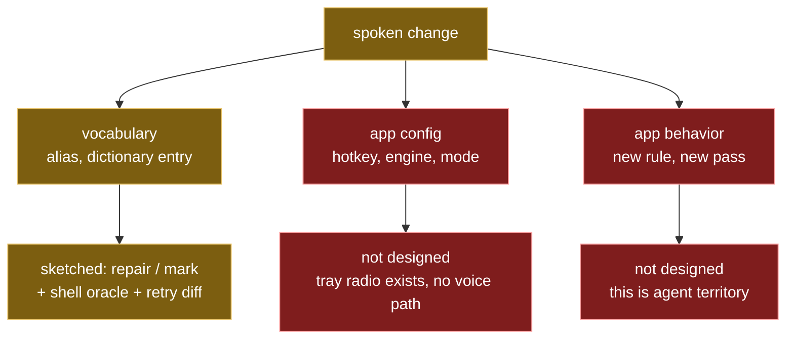

# Dictation as a control channel — gap map

Where the 2026-08-31 session's sketches sit against the actual problem.

## What exists today

Every utterance is content. There is no other possibility in the code.

One path, no branch. `fix_transcription` is a text→text function; it cannot
decline to return text, so nothing upstream can decide an utterance was not
meant to be typed.

## What the problem actually needs

Green is built. Amber was designed this session. Red is untouched.

## The load-bearing gap is the diamond

Everything amber is mechanism — a grammar, a store, a write path. All of it is
straightforward, roughly 300 lines, no new dependencies.

The red node is a *decision*, and none of the sketches make it. What was
proposed is a prefix match:

That is a heuristic standing in for classification. It works for the utterances
it was designed against and fails on:

- a command phrased naturally — *"can you make concept mean transfusion"*
- a command that does not lead with the trigger
- prose that happens to open with the trigger word

`Smoke-Human-vocabulary.md` §1.3 and §1.4 exist precisely to measure how badly.
They are the viability cases, not the correctness cases.

## The second gap: scope

"Dictation of feature changes" is larger than vocabulary. The sketches only
reach the narrowest corner of it.

Vocabulary is the easy corner because the target is a flat key→value store that
already exists on disk. Config is harder — the tray switcher proves the state
can be mutated at runtime, but nothing routes speech to it. Behavior change is a
different category of problem entirely.

## What the session actually established

Not a step toward voice control. A demonstration that the surfaces hold:

- one post-processing call site, engine-agnostic by construction
- a model-discovery layer that takes a structurally different engine without a
  parallel pipeline
- a tray whose menu state is now correct end to end, including nested items
- measured signal sources: Granite exposes CTC logits, Parakeet exposes none,
  engine disagreement needs neither

  > **Corrected 2026-09-06.** "Parakeet exposes none" describes the
  > `parakeet-rs` crate, which runs the decode internally and returns a
  > `String`. The joint network's vocab logits are in
  > `decoder_joint-model.onnx`; driving the two sessions directly with `ort`
  > yields per-token probability, word confidence and timestamps from the files
  > already on disk. `murmure-reference.md` records the shape (the clone
  > itself was removed). This error sent the command-channel plan toward Granite; see
  > `TASKBOARD.md` and `Parakeet-v3.md` §5.

Those are the preconditions for building the diamond. They are not the diamond.

## Honest ranking of what is unsolved

1. **Intent classification.** The prefix heuristic is a placeholder. Everything
   else is downstream of it and cheap by comparison.
2. **Scope beyond vocabulary.** Config-by-voice has an existing mutation path
   (the tray switcher) and no route to it.
3. **WER.** Granite and Parakeet are close enough that neither is the
   bottleneck. Improving transcription does not move this problem.
